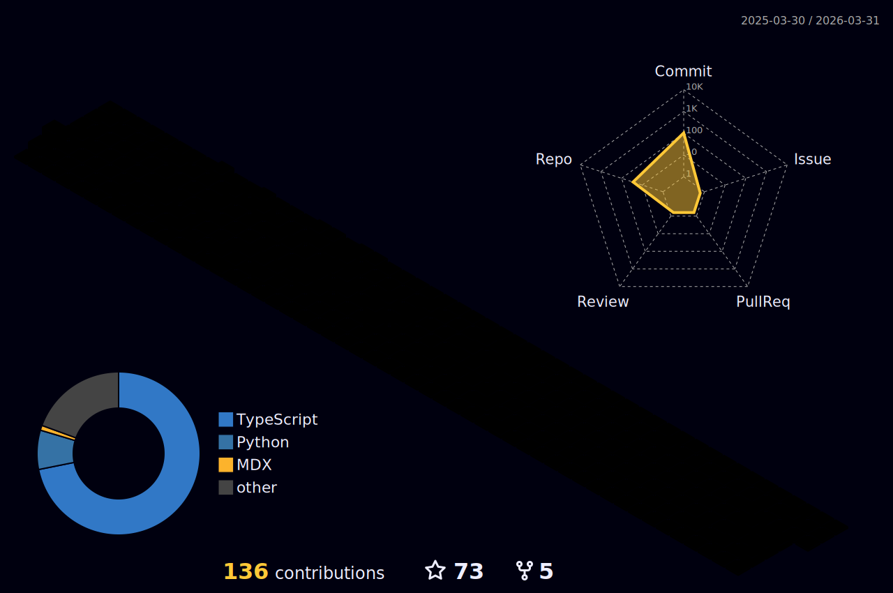

I'm focused on **Bigdata,  Flink and Data lake**
- To read more about me: Blog
- To know what I'm doing: [Note](https://sherlock-xpf.github.io/logsel-notes-repo/#/page/contents)
- To subscribe my newsletter: Newsletter
- Also, follow me on [X](https://twitter.com/home)
  
I’m looking for help with some open source project to promote my ability to codingng

